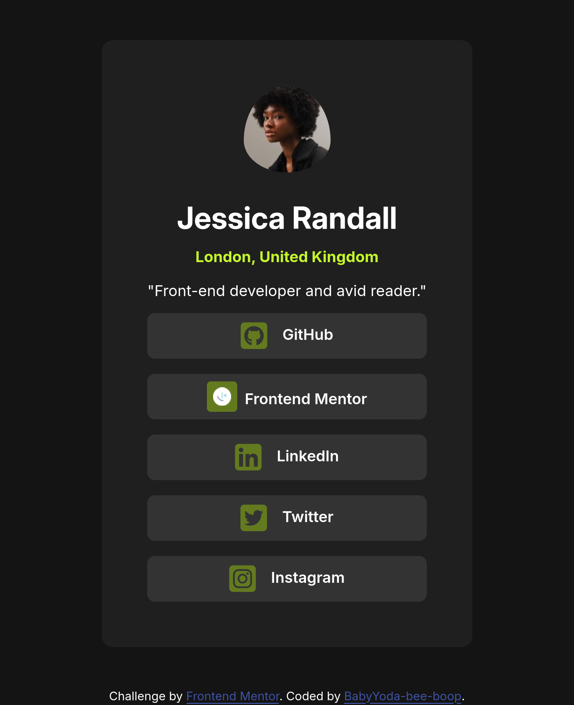
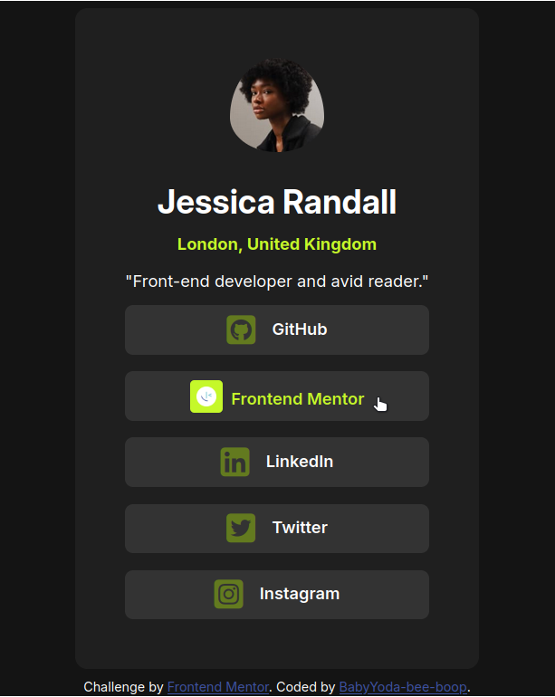

# Frontend Mentor - Social links profile solution

This is a solution to the [Social links profile challenge on Frontend Mentor](https://www.frontendmentor.io/challenges/social-links-profile-UG32l9m6dQ). Frontend Mentor challenges help you improve your coding skills by building realistic projects. 

## Table of contents

- [Overview](#overview)
  - [The challenge](#the-challenge)
  - [Screenshot](#screenshot)
  - [Links](#links)
- [My process](#my-process)
  - [Built with](#built-with)
  - [What I learned](#what-i-learned)
  - [Useful resources](#useful-resources)
- [Author](#author)

## Overview

### The challenge

Users should be able to:

- See hover and focus states for all interactive elements on the page

### Screenshot

 


### Links

- Solution URL: [Add solution URL here](https://your-solution-url.com)
- Live Site URL: [Add live site URL here](https://your-live-site-url.com)

## My process

### Built with

- Semantic HTML5 markup
- CSS custom properties
- Flexbox

### What I learned

The easiest way to insert icons from Font Awesome is by using HTML tags, but I chose to use pseudo-elements to practice.

I created the Frontend Mentor icon by combining the provided favicon with a styled background:

```scss
.frontend-mentor {
  &::before {
    content: "";
    display: inline-block;
    background-image: url("../assets/images/favicon-32x32.png");
    background-position: center;
    background-size: 60%;
    background-repeat: no-repeat;
    border-radius: var(--padding-50);
    width: 2em;
    aspect-ratio: 1;
    background-color: hsl(from var(--clr-accent) h 60% 30%);
    vertical-align: -0.5em;
    margin-right: var(--padding-100);
    transition: all 0.5s ease;
  }
  &:hover::before,
  &:focus::before {
    background-color: var(--clr-accent);
  }
}
```

### Useful resources

- [Font Awesome Icons](https://fontawesome.com/) - Used for the social media icons in the project

## Author

- Website - [BabyYoda-bee-boop](https://github.com/BabyYoda-bee-boop)
- Frontend Mentor - [@BabyYoda-bee-boop](https://www.frontendmentor.io/profile/BabyYoda-bee-boop)
